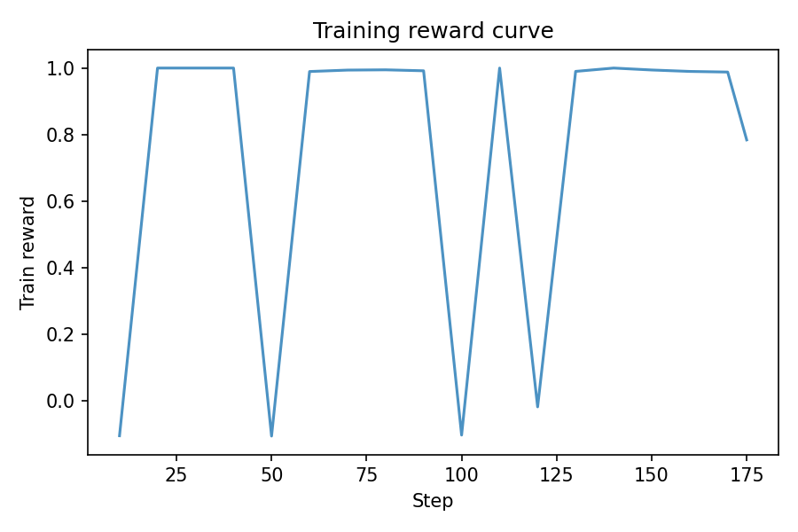
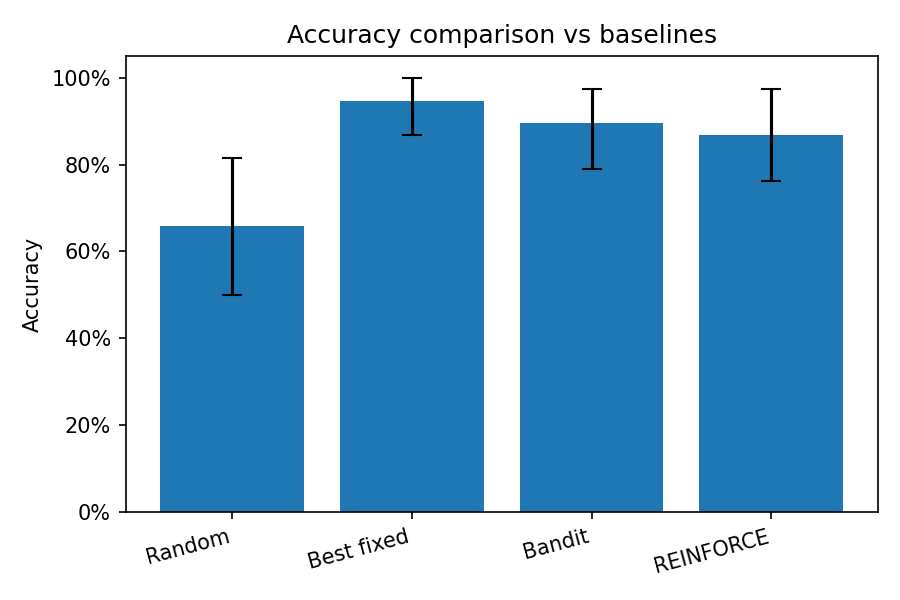
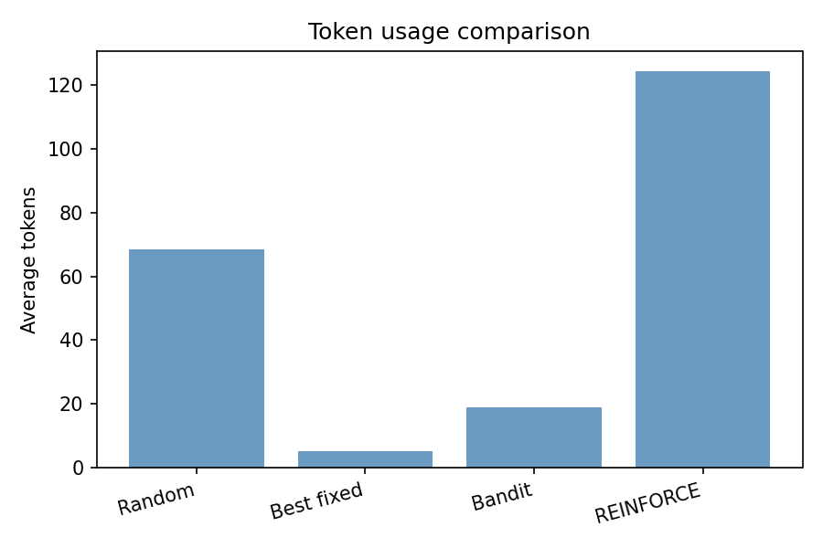

# RL Reasoning Optimizer

A reinforcement learning system that learns to **select and optimize reasoning strategies** (prompt templates) to improve LLM task performance while controlling token usage. The RL agent learns which reasoning strategy to apply for each question.

Works with **local LLMs (Ollama)** and **API-based LLMs** (OpenAI/Anthropic compatible).

---

## Problem motivation

Large language models can solve tasks using different *reasoning strategies*: direct answer, chain-of-thought, problem decomposition, verification, minimal tokens, etc. The best strategy often depends on the question. Using a single fixed strategy can be suboptimal (waste tokens on easy questions, or fail on hard ones). This project formulates **strategy selection as an RL problem**: an agent observes question features and chooses a reasoning strategy; the environment runs the LLM with the chosen prompt and returns a reward that balances **correctness** and **token cost**.

---

## MDP formulation

- **State**: Question text plus simple features (length, number count); optionally previous attempt result.
- **Action**: Choose a reasoning strategy from a discrete set of prompt templates:
  - `direct_answer`, `chain_of_thought`, `decompose_problem`, `scratchpad_reasoning`, `verify_answer`, `explain_then_answer`, `minimal_tokens`, `self_consistency`
- **Transition**: Environment calls the LLM backend with the selected prompt; episode ends after one attempt (MVP).
- **Reward**:
  - +1 if answer is correct, 0 if incorrect
  - − `token_penalty × tokens_used`
  - Optional: formatting penalty when the model does not output `FINAL: <answer>`

---

## Reward design

| Component        | Formula / description                                      |
|-----------------|------------------------------------------------------------|
| Correctness      | +1 if parsed answer matches ground truth (numeric or text) |
| Token penalty    | −`scale × tokens_used` (default scale 1e-4)                |
| Format penalty   | −0.1 if `FINAL:` line is missing                          |

LLM output must follow the format: **`FINAL: <answer>`** for correctness to be scored.

---

## System architecture

```
┌─────────────────────────────────────────────────────────────────┐
│                        RL Reasoner (Agent)                        │
│  Policy network (MLP on TF-IDF features) → action = strategy id  │
└───────────────────────────────────┬─────────────────────────────┘
                                    │
                                    ▼
┌─────────────────────────────────────────────────────────────────┐
│                     LLM Reasoning Environment                      │
│  State: question + features   Action: strategy   Reward: R - λ·T  │
└───────────────────────────────────┬─────────────────────────────┘
                                    │
                    ┌───────────────┴───────────────┐
                    ▼                               ▼
         ┌──────────────────┐            ┌──────────────────┐
         │  LocalBackend    │            │   APIBackend      │
         │  (Ollama)        │            │  (OpenAI-style)   │
         └──────────────────┘            └──────────────────┘
                    │                               │
                    ▼                               ▼
         ┌──────────────────┐            ┌──────────────────┐
         │  Prompt templates │◄──────────│  Prompt library   │
         │  (Jinja2)         │            │  (8 strategies)   │
         └──────────────────┘            └──────────────────┘
```

---

## Repository structure

```
rl-reasoning-optimizer/
├── README.md
├── requirements.txt
├── setup.sh
├── .gitignore
├── configs/           # default.yaml, local_ollama.yaml, api_model.yaml
├── data/              # math_small.jsonl
├── results/plots/     # Generated plots
├── runs/              # TensorBoard & CSV logs (gitignored)
├── scripts/
│   ├── train_reinforce.py
│   ├── run_bandit_baseline.py
│   ├── evaluate_models.py
│   ├── plot_results.py
│   └── check_ollama.py
├── src/rl_reasoning_optimizer/
│   ├── backends/      # base, local (Ollama), API
│   ├── env/           # LLMReasoningEnv (MDP)
│   ├── agents/        # REINFORCE, bandits, policy network
│   ├── prompts/       # prompt_library (Jinja2 templates)
│   ├── reward/        # scoring, penalties
│   ├── eval/          # evaluate, bootstrap_ci, baselines
│   └── utils/         # config, logging, seeding
└── tests/
    ├── test_env_step.py
    ├── test_scoring.py
    └── test_prompt_rendering.py
```

---

## Environment setup (venv)

The project is designed to run **entirely inside a Python virtual environment**.

1. Clone and enter the repo:
   ```bash
   git clone <repo-url>
   cd rl-reasoning-optimizer
   ```

2. Create and activate a venv, then install dependencies:

   **Windows (PowerShell)** — use the PowerShell activation script:
   ```powershell
   python -m venv .venv
   .venv\Scripts\Activate.ps1
   pip install -r requirements.txt
   ```
   If you get an execution policy error, run once: `Set-ExecutionPolicy -ExecutionPolicy RemoteSigned -Scope CurrentUser`

   **Windows (CMD)**:
   ```cmd
   python -m venv .venv
   .venv\Scripts\activate.bat
   pip install -r requirements.txt
   ```

   **macOS / Linux / Git Bash**:
   ```bash
   python -m venv .venv
   source .venv/bin/activate
   pip install -r requirements.txt
   ```

   Or use the setup script:
   ```bash
   bash setup.sh
   ```
   Then activate the venv as above before running any commands.

All subsequent commands assume the venv is activated.

**Faster runs:** In `configs/default.yaml`, set `max_episodes: 30` (or any number) to limit training/episode count for quick tests. Leave `max_episodes: null` for full runs. Per-episode output files are off by default (`save_episode_outputs: false`); set to `true` only when debugging.

---

## Using Ollama (local LLM)

To use a **real local model** instead of the stub (so you get real accuracy and learning):

1. **Install Ollama**  
   - Download and install from [https://ollama.com](https://ollama.com).  
   - On Windows/macOS/Linux, Ollama usually runs in the background after install.

2. **Pull a model**  
   In a terminal:
   ```bash
   ollama pull llama3.2
   ```
   Or a smaller/faster model:
   ```bash
   ollama pull phi
   ```
   Use the same name in config (see step 4).

3. **Check that Ollama is reachable**  
   From the project root with your venv activated:
   ```powershell
   python scripts/check_ollama.py
   ```
   You should see: `Ollama is running and model '...' is available.`

4. **Run with the Ollama config**  
   The config `local_ollama` uses your local Ollama and **disables the stub** (so the app fails clearly if Ollama is not running). It uses the model name in `configs/local_ollama.yaml` (default `llama3.2`). To use a different model, edit that file and set `model: your-model-name`.

   ```powershell
   python scripts/train_reinforce.py --config local_ollama
   python scripts/run_bandit_baseline.py --config local_ollama
   python scripts/evaluate_models.py --config local_ollama
   python scripts/plot_results.py
   ```

   For a full run with Ollama, set `max_episodes: null` in `configs/default.yaml` (or in `local_ollama.yaml` to override), then run the same commands. Training will be slower (real LLM calls) but accuracy and reward curves will be meaningful.

---

## Baseline results (example)

With the **stub backend** (no real LLM), metrics are illustrative. With a real local or API LLM, you will see actual accuracy and token usage.

| Method        | Accuracy (point) | 95% CI (approx) | Avg tokens |
|---------------|------------------|------------------|------------|
| Random        | ~0.25            | [0.20, 0.30]     | ~800       |
| Best fixed    | ~0.45            | [0.40, 0.50]     | ~600       |
| Bandit (ε-greedy) | ~0.42         | [0.37, 0.47]     | ~650       |
| REINFORCE     | ~0.48           | [0.43, 0.53]     | ~550       |

Run `python scripts/evaluate_models.py` to compute these with bootstrap CIs on your data.

---

## Example plots

After training and evaluation, generate plots with `python scripts/plot_results.py`. Plots are saved under `results/plots/`. Commit and push the PNG files so they appear on GitHub.

**Training reward curve** (from latest run in `runs/reinforce/`):



**Accuracy comparison** (from `results/eval_results.json`):



**Token usage comparison**:



---

## Future improvements

- **Multi-step episodes**: Allow retry with a different strategy on failure.
- **Larger datasets**: Scale to GSM8K, MATH, or custom benchmarks.
- **Learned baseline**: Use a value function (e.g. MLP) to reduce variance in REINFORCE.
- **Strategy embeddings**: Learn or fine-tune prompt representations.
- **API cost**: Add cost-aware reward (e.g. $/1K tokens for OpenAI).
- **More backends**: Anthropic SDK, vLLM, etc.

---

## Quick Start

**Windows (PowerShell)** — from the project root:

```powershell
python -m venv .venv
.venv\Scripts\Activate.ps1
pip install -r requirements.txt
python scripts/train_reinforce.py
```

If PowerShell says running scripts is disabled, run once (then try again):
```powershell
Set-ExecutionPolicy -ExecutionPolicy RemoteSigned -Scope CurrentUser
```

**Windows (CMD)**:

```cmd
python -m venv .venv
.venv\Scripts\activate.bat
pip install -r requirements.txt
python scripts/train_reinforce.py
```

**macOS / Linux / Git Bash**:

```bash
python -m venv .venv
source .venv/bin/activate
pip install -r requirements.txt
python scripts/train_reinforce.py
```

Training uses the default config (`configs/default.yaml`) and the stub local backend if Ollama is not running, so it completes without an API key. Logs go to `runs/reinforce/`. Then run baselines and evaluation:

```bash
python scripts/run_bandit_baseline.py
python scripts/evaluate_models.py
python scripts/plot_results.py
```

Run tests:

```bash
pytest tests/ -v
```
